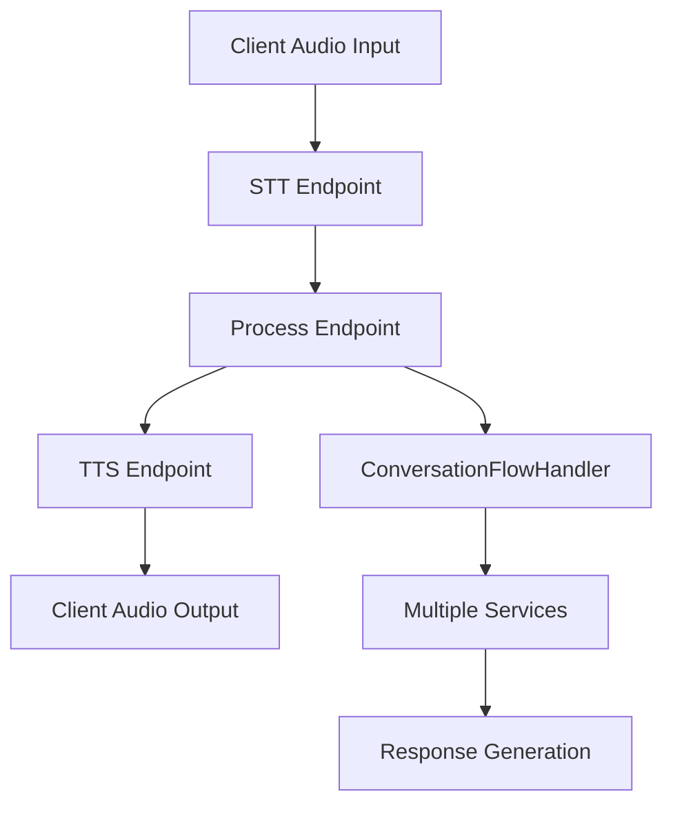

# Voice Agent Architecture Documentation

## Overview

The After Hours Call Agent (AHCA) is an AI-powered voice assistant system that provides automated customer service through natural voice conversations. It follows OpenAI's recommended **Chained Architecture** for voice agents:

```
Audio Input → STT (Whisper) → Text Processing (GPT-4 + RAG) → TTS (TTS-1) → Audio Output
```

## System Architecture

### High-Level Flow



### Core Components

1. **Route Layer** (`chained-voice.js`) - Thin HTTP controllers
2. **Service Layer** (`/services/`) - Business logic and domain services
3. **Shared Services** (`/shared/services/`) - External integrations (OpenAI, Calendar, Email)

## Refactored Architecture

### Service Classes

#### 1. **ConversationStateManager.js**
**Purpose**: Manages session state and transitions

**Key Methods**:
- `getSession(sessionId)` - Get or create session
- `addMessage(sessionId, role, content)` - Add to conversation history
- `updateUserInfo(sessionId, userInfo)` - Update user information
- `cleanupOldSessions(maxAge)` - Automatic session cleanup

**When Used**: Every request to maintain session state

#### 2. **UserInfoCollector.js**
**Purpose**: Handles Phase 1 - Name and email collection

**Key Methods**:
- `processCollection(text, currentUserInfo)` - Main collection logic
- `extractUserInfo(text)` - Extract name/email with OpenAI + fallback regex
- `handleNameChange(text)` / `handleEmailChange(text)` - Handle changes during conversation

**When Used**: 
- When `session.userInfo.collected === false`
- When name/email change patterns are detected

#### 3. **IntentClassifier.js**
**Purpose**: Classifies user intents using pattern matching

**Key Methods**:
- `classifyIntent(text)` - Main classification with confidence scoring
- `isGoodbye(text)` - Detect conversation end
- `isAppointmentRequest(text)` - Detect appointment requests

**When Used**: Every user message to determine conversation flow

#### 4. **AppointmentFlowManager.js**
**Purpose**: Manages complete appointment booking state machine

**Key Methods**:
- `processFlow(session, text, getCalendarService)` - Main flow processor
- `handleCalendarSelection()` - Step 1: Google vs Microsoft
- `handleServiceCollection()` - Step 2: Service type extraction
- `handleDateCollection()` - Step 3: Date parsing and availability
- `handleTimeCollection()` - Step 4: Time slot selection
- `handleReview()` - Step 5: Review and changes
- `createAppointment()` - Final appointment creation

**When Used**: When appointment flow is active or appointment intent detected

#### 5. **DateTimeParser.js**
**Purpose**: Handles date and time parsing utilities

**Key Methods**:
- `parseDateFromText(text)` - Natural language date parsing
- `findSelectedTimeSlot(text, availableSlots)` - Match user input to time slots
- `normalizeOrdinals(text)` - Convert "first" to "1st", etc.

**When Used**: During appointment date/time collection

#### 6. **ResponseGenerator.js**
**Purpose**: Generates natural language responses

**Key Methods**:
- `generateGoodbyeResponse(userName)` - Personalized goodbye
- `generateAppointmentReviewResponse(details, userInfo)` - Appointment summary
- `generateConversationalResponse(text, history, userInfo)` - General responses
- `generateFollowUpResponse(baseResponse)` - Add follow-up questions

**When Used**: Throughout conversation for consistent response formatting

#### 7. **ConversationFlowHandler.js**
**Purpose**: Central orchestrator coordinating all services

**Key Methods**:
- `processConversation(text, sessionId)` - Main entry point
- `handleUserInfoCollection()` - Phase 1 coordination
- `handleMainConversation()` - Phase 2 coordination
- `handleAppointmentFlow()` - Appointment coordination
- `sendConversationSummary()` - Email integration

**When Used**: Every `/process` request - this is the main controller

#### 8. **OpenAIService.js**
**Purpose**: Wrapper for OpenAI API calls with retry logic

**Key Methods**:
- `callOpenAI(messages, model, retries)` - Chat completions with retry
- `transcribeAudio(audioBuffer)` - Whisper STT
- `synthesizeText(text, voice, model)` - TTS generation

**When Used**: All OpenAI API interactions across the system

## Conversation Flow States

### Phase 1: User Information Collection
**Trigger**: `session.userInfo.collected === false`

**Flow**:
1. User sends any message
2. `UserInfoCollector.processCollection()` extracts name/email
3. If incomplete, asks for missing information
4. If complete, sets `collected = true` and transitions to Phase 2

### Phase 2: Main Conversation
**Trigger**: `session.userInfo.collected === true`

**Sub-flows**:

#### A. Company Information Queries
- **Trigger**: `CompanyInfoService.isCompanyInfoQuery(text)`
- **Response**: Immediate company info + follow-up question
- **Sets**: `awaitingFollowUp = true`

#### B. Appointment Requests
- **Trigger**: Intent classifier detects appointment patterns
- **Flow**: 8-step appointment booking process
- **States**: `select_calendar` → `collect_title` → `collect_date` → `collect_time` → `review` → `confirm`

#### C. Follow-up Handling
- **Trigger**: `session.awaitingFollowUp === true`
- **Options**: More questions, appointment request, or new query

#### D. Regular Q&A with RAG
- **Trigger**: Default case for questions
- **Process**: Extract search terms → RAG search → Generate response
- **Sets**: `awaitingFollowUp = true` after first response

### Special Intents (Any Time)
- **Goodbye**: Immediate conversation end + email summary
- **Name/Email Changes**: Update user info during conversation

## API Endpoints

### POST `/api/chained-voice/transcribe`
**Purpose**: Convert audio to text using Whisper
**Handler**: Direct OpenAI service call
**Input**: `{audio: base64, sessionId: string}`
**Output**: `{success: boolean, text: string, sessionId: string}`

### POST `/api/chained-voice/process`
**Purpose**: Main conversation processing
**Handler**: `ConversationFlowHandler.processConversation()`
**Input**: `{text: string, sessionId: string}`
**Output**: Complete conversation state + response

### POST `/api/chained-voice/synthesize`
**Purpose**: Convert text to speech using TTS
**Handler**: Direct OpenAI service call
**Input**: `{text: string, sessionId: string}`
**Output**: `{success: boolean, audio: base64, sessionId: string}`

### DELETE `/api/chained-voice/session/:sessionId`
**Purpose**: Manual session cleanup
**Handler**: `ConversationFlowHandler.cleanupSession()`

### GET `/api/chained-voice/health`
**Purpose**: Service health monitoring
**Handler**: Direct service status checks

## Data Flow Example

### Complete Conversation Flow:

1. **User**: "Hi, I need help with fencing"
   - **Route**: `/process` → `ConversationFlowHandler`
   - **Service**: `IntentClassifier` → No special intent
   - **Flow**: Phase 1 (no user info) → `UserInfoCollector`
   - **Response**: "Please provide name and email"

2. **User**: "My name is John and email is j-o-h-n at gmail dot com"
   - **Service**: `UserInfoCollector.extractUserInfo()` → OpenAI extraction
   - **Result**: `{name: "John", email: "john@gmail.com", collected: true}`
   - **Response**: "Thanks John! How can I help?"

3. **User**: "What are your business hours?"
   - **Flow**: Phase 2 → `CompanyInfoService.isCompanyInfoQuery()` → true
   - **Response**: Business hours + "Anything else or appointment?"
   - **State**: `awaitingFollowUp = true`

4. **User**: "I'd like to schedule an appointment"
   - **Service**: `IntentClassifier` → appointment intent
   - **Flow**: `AppointmentFlowManager.initializeFlow()`
   - **Response**: "Google or Microsoft Calendar?"
   - **State**: `appointmentFlow.active = true, step = 'select_calendar'`

5. **User**: "Google"
   - **Flow**: `AppointmentFlowManager.handleCalendarSelection()`
   - **State**: `calendarType = 'google', step = 'collect_title'`
   - **Response**: "What type of service?"

6. **User**: "Fence repair estimate"
   - **Service**: `AppointmentFlowManager.extractServiceType()` → OpenAI
   - **Result**: "Fence estimate"
   - **State**: `step = 'collect_date'`
   - **Response**: "What date works best?"

...and so on through the complete appointment flow.

## Error Handling

### Graceful Degradation
- **OpenAI Service Down**: Falls back to regex patterns and hardcoded responses
- **Calendar Service Error**: Provides phone number for manual booking
- **Email Service Error**: Logs error but continues conversation

### Retry Logic
- **OpenAI API**: Exponential backoff with 3 retries
- **Transient Errors**: Automatic retry for 503/429 status codes

## Session Management

### Session Structure
```javascript
{
  conversationHistory: [],
  userInfo: { name: null, email: null, collected: false },
  appointmentFlow: { active: false, step: 'none', details: {}, calendarType: null },
  awaitingFollowUp: false,
  createdAt: new Date()
}
```

### Automatic Cleanup
- **Interval**: Every 5 minutes
- **Max Age**: 30 minutes
- **Action**: Send email summary before deletion

## Integration Points

### External Services
- **OpenAI**: STT, TTS, Chat Completions
- **Google Calendar**: Appointment creation
- **Microsoft Calendar**: Appointment creation  
- **Email Service**: Conversation summaries
- **MongoDB**: Knowledge base for RAG

### Client Integration
- **Same API**: No changes required to client code
- **WebRTC**: Audio streaming for real-time conversation
- **Session Management**: Client maintains sessionId across requests

## Performance Considerations

### Optimizations
- **Parallel Processing**: Multiple services can run concurrently
- **Caching**: Session state cached in memory
- **Streaming**: Audio processed in chunks
- **Lazy Loading**: Services initialized only when needed

### Scalability
- **Stateless Design**: Sessions can be moved to external store (Redis)
- **Service Separation**: Each service can be scaled independently
- **Load Balancing**: Multiple instances can share session store

## Monitoring and Debugging

### Logging
- **Structured Logging**: Each service logs with consistent format
- **Request Tracing**: SessionId tracks requests across services
- **Error Context**: Full error context with user state

### Health Checks
- **Service Status**: Individual service health monitoring
- **API Connectivity**: OpenAI, Calendar, Email service checks
- **Session Metrics**: Active session count and cleanup stats
